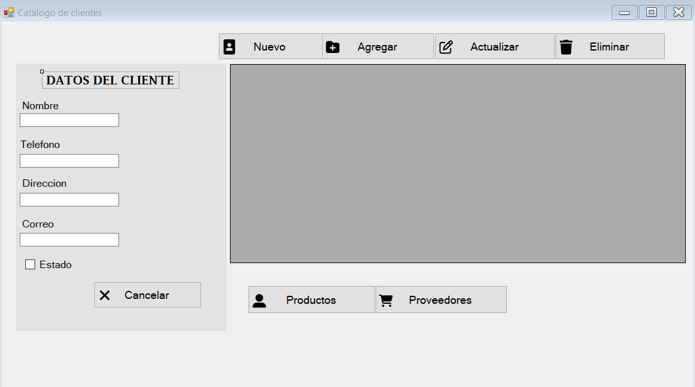
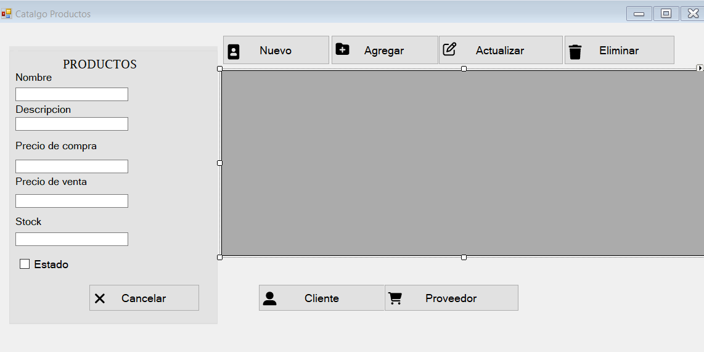
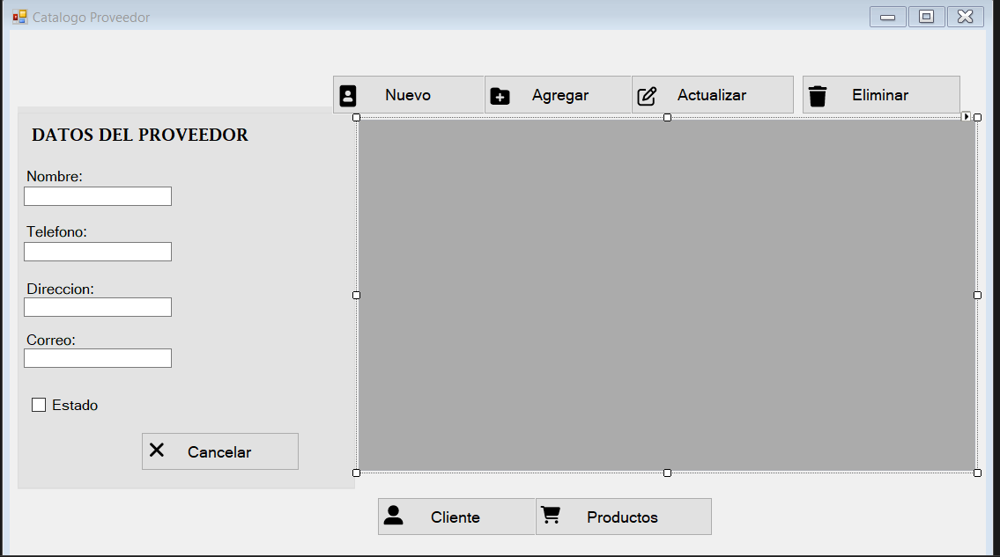

# CRUD - Aplicación de Escritorio en C#

## Descripción

Aplicación de escritorio Windows Forms que permite realizar operaciones CRUD (Crear, Leer, Actualizar y Eliminar) sobre las entidades **Cliente**, **Producto** y **Proveedor**, implementada con una arquitectura de 3 capas.

## Tabla de Contenidos

- [Arquitectura](#arquitectura)
- [Tecnologías](#tecnologías)
- [Requisitos](#requisitos)
- [Instalación](#instalación)
- [Configuración](#configuración)
- [Estructura del Proyecto](#estructura-del-proyecto)
- [Uso](#uso)
- [Capturas de Pantalla](#capturas-de-pantalla)
- [Contribuciones](#contribuciones)
- [Licencia](#licencia)
- [Contacto](#contacto)

## Arquitectura

El proyecto sigue el patrón de **3 capas**:

1. **DataLayer**: Acceso a datos (clases de entidad y clases de datos) en `DataLayer/`.
2. **BNLayer**: Lógica de negocio y validaciones en `BNLayer/`.
3. **CRUD**: Capa de presentación con Windows Forms en `CRUD/`.

## Tecnologías

- **Lenguaje:** C# (.NET Framework)
- **Interfaz:** Windows Forms
- **IDE:** Visual Studio
- **Base de Datos:** SQL Server (o compatible)

## Requisitos

- Windows 10 o superior
- Visual Studio 2019 o superior
- .NET Framework instalado
- Instancia de SQL Server (Express o Developer)

## Instalación

1. Clonar el repositorio:
   ```bash
   git clone https://github.com/fabian04102024/CRUD.git
   cd CRUD
   ```
2. Abrir la solución `CRUD.sln` en Visual Studio.
3. Restaurar paquetes NuGet si es necesario.

## Configuración

- Editar la cadena de conexión en `DataLayer/conexion.cs` para apuntar a tu servidor de base de datos.

## Estructura del Proyecto

```plaintext
CRUD/                   # Solución y capa de presentación
├─ CRUD/                # Proyecto WinForms
│  ├─ Program.cs        # Punto de entrada
│  ├─ frmCliente.*      # Formulario Clientes
│  ├─ frmProductos.*    # Formulario Productos
│  └─ frmProveedor.*    # Formulario Proveedores
├─ DataLayer/           # Capa de acceso a datos
│  ├─ Cliente.cs
│  ├─ ClientesDatos.cs
│  ├─ Producto.cs
│  ├─ ProductosDatos.cs
│  ├─ Proveedor.cs
│  ├─ ProveedorDatos.cs
│  └─ conexion.cs       # Configuración de BD
└─ BNLayer/             # Capa de lógica de negocio
   ├─ ClienteNegocio.cs
   ├─ ProductoNegocio.cs
   └─ ProveedorNegocio.cs
```

## Uso

1. Ejecutar el proyecto de presentación (`CRUD`) en Visual Studio.
2. Navegar entre los formularios de **Cliente**, **Producto** y **Proveedor**.
3. Realizar operaciones de **Crear**, **Leer**, **Actualizar** y **Eliminar**.

## Capturas de Pantalla







## Contribuciones

¡Las contribuciones son bienvenidas! Para sugerir mejoras o reportar errores:
1. Haz un fork de este repositorio.
2. Crea una rama (`git checkout -b mejora-xyz`).
3. Realiza tus cambios y haz commit.
4. Envía un Pull Request.

## Licencia

Este proyecto está bajo la licencia **MIT**. Consulta el archivo [LICENSE](LICENSE) para más detalles.

## Contacto

- **Autor:** fabian04102024
- **Repositorio:** https://github.com/fabian04102024/CRUD

